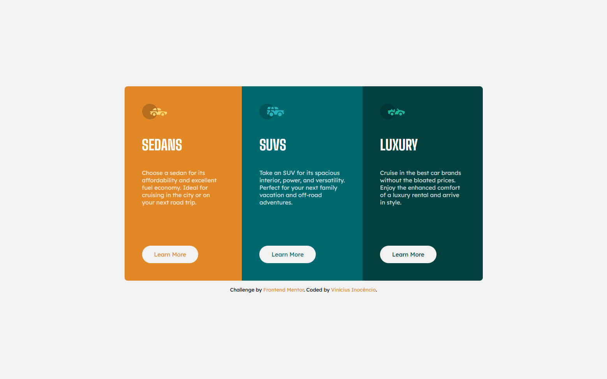
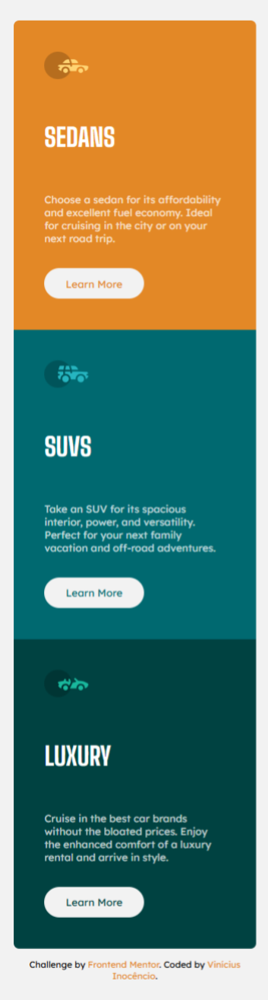

# 🚗 Column Preview Card

Uma landing page responsiva que apresenta três categorias de veículos — **Sedans**, **SUVs** e **Luxury** — com foco em um layout limpo, uso eficiente de CSS e estrutura HTML bem definida.

---

## 📌 Descrição

Este projeto foi desenvolvido como parte de um desafio da **Frontend Mentor** para treinar a construção de interfaces simples. Foi uma ótima oportunidade para praticar **HTML semântico**, **Flexbox**, **Grid** e conceitos básicos de responsividade. Algumas classes foram aplicadas apenas em certas tags para treinar o uso de **pseudo-classes** no CSS.

---

## ⚙️ Funcionalidades

- Estrutura com `HTML5` semântico
- Estilização com `CSS3` (cores, fontes, alinhamento, espaçamento)
- Layout responsivo com **Grid**, **Flexbox** e **Media Queries**

---

## 🛠️ Tecnologias

- HTML5  
- CSS3  

---

## 🖥️ Resultado

### 💻 Versão Desktop  

### 📱 Versão Mobile  

---

🔗 [**Clique aqui para visualizar o projeto no GitHub Pages**](https://inocenciooo.github.io/column-preview)

---

## 💬 Contribuições

Este projeto faz parte do meu processo de aprendizado em **desenvolvimento front-end**. Sugestões e melhorias são sempre bem-vindas!
